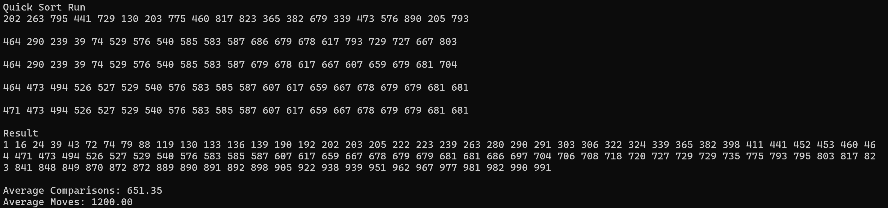

# quicksort {Result Image}

선택 정렬은 단순하지만 퀵 정렬이 훨씬 빠르다.
삽입 정렬은 소규모 데이터에서 퀵 정렬보다 빠르지만, 데이터가 많아지면 퀵 정렬이 더 빠르다.
버블 정렬은 비효율적이고, 퀵 정렬과 비교할 수 없을 정도로 느리다.
쉘 정렬은 퀵 정렬보다 조금 느리지만, 비교적 간단하게 구현 가능하다.
합병 정렬은 퀵 정렬과 유사한 시간 복잡도지만, 메모리 사용량이 더 많다.
