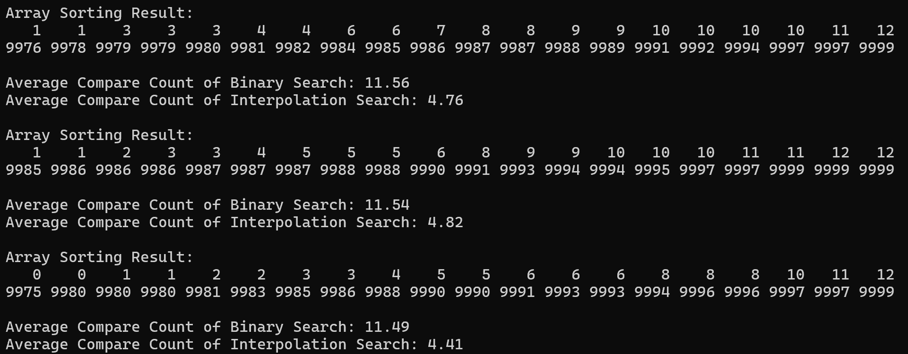

# interpolationSearch {Result Image}

이진 탐색은 정렬된 배열에서만 사용할 수 있지만,
매번 탐색 범위를 절반씩 줄여 나가기 때문에 탐색 속도가 매우 빠르고 비교 횟수가 적습니다.
반면, 순차 탐색은 배열의 정렬 여부와 관계없이 처음부터 끝까지 하나씩 데이터를 확인해야 하므로,
탐색 대상이 많아질수록 비교 횟수가 크게 늘어납니다.

퀵 정렬을 통해 배열을 정렬한 뒤 이진 탐색을 사용하면,
배열 크기가 n일 때 최악의 경우 비교 횟수가 O(log 2 n)으로 줄어들어,
순차 탐색의 최악의 경우 O(n)에 비해 훨씬 효율적입니다.
따라서, 정렬된 데이터를 탐색할 때 이진 탐색이 순차 탐색보다 탐색 시간이 짧고 효율이 높습니다.
