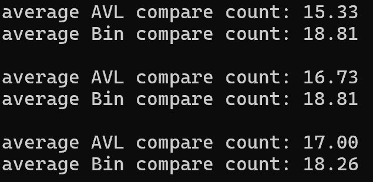

# compareAVL {Result Image}

이진 탐색 트리는 트리의 균형이 맞지 않으면 탐색 성능이 저하될 수 있지만,
AVL 트리는 삽입 시 균형을 맞추어 항상 높이가 최소로 유지되므로 탐색 성능이 일정하게 유지된다.
AVL 트리는 비교 횟수가 상대적으로 적고 일정하게 유지되고,
반면, 이진 탐색 트리는 트리가 비대칭적으로 자라면 탐색 비교 횟수가 크게 증가할 수 있다.
따라서, AVL 트리는 일반적으로 더 효율적인 탐색 성능을 보여준다.
